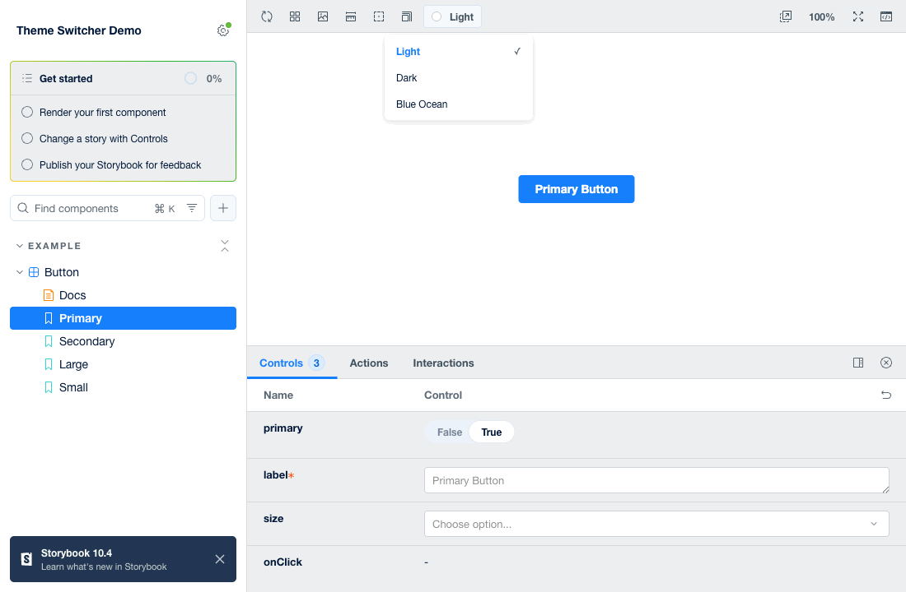
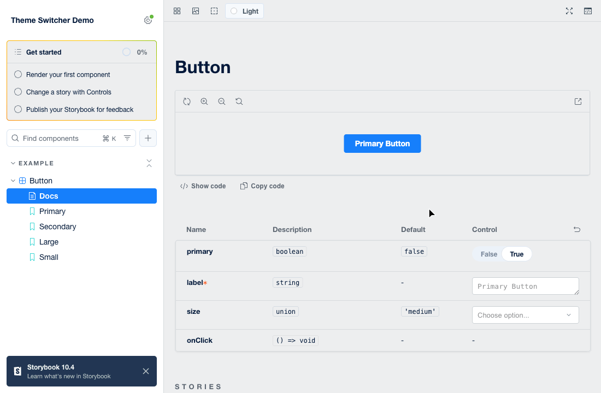

# sb-theme-switcher

Аддон Storybook для переключения тем. Один конфиг в `main.js` — кнопка в тулбаре, UI менеджера, preview-iframe и docs-страницы переключаются вместе.


[English](./README.md) | **Русский**



## Возможности

- **Один конфиг, всё синхронно** — UI менеджера, preview-iframe и docs переключаются вместе; декораторы не нужны
- **Умный UI в тулбаре** — тоггл для 2 тем, дропдаун с цветовыми индикаторами для 3+
- **Персистентность** — выбор сохраняется в localStorage и восстанавливается при загрузке (включая прямое открытие `iframe.html`), синхронизируется между вкладками
- **Поддержка Docs** — готовый `DocsContainer`, реактивно перекрашивающий страницы документации
- **TypeScript** — полные типы в комплекте

## Установка

```bash
npm install --save-dev sb-theme-switcher
# или
yarn add --dev sb-theme-switcher
```

## Быстрый старт

### 1. Создайте темы Storybook

`.storybook/themes.ts` — обычные [объекты тем Storybook](https://storybook.js.org/docs/configure/user-interface/theming), они определяют цвета самого UI Storybook:

```typescript
import { create } from 'storybook/theming'; // Storybook 8: '@storybook/theming'

export const lightTheme = create({
  base: 'light',
  brandTitle: 'My App',
  appBg: '#FFFFFF',
  barBg: '#EDEEEF'
  // ...любые другие опции темы
});

export const darkTheme = create({
  base: 'dark',
  brandTitle: 'My App',
  appBg: '#455161',
  barBg: '#455161'
});
```

### 2. Зарегистрируйте аддон с темами

`.storybook/main.ts`:

```typescript
import { lightTheme, darkTheme } from './themes';

export default {
  addons: [
    {
      name: 'sb-theme-switcher',
      options: {
        themes: [
          { id: 'light', title: 'Светлая', class: 'light-theme', storybookTheme: lightTheme },
          { id: 'dark', title: 'Темная', class: 'dark-theme', storybookTheme: darkTheme }
        ],
        defaultTheme: 'light',
        storageKey: 'my-app-theme'
      }
    }
  ]
};
```

Это всё, что нужно аддону: опции автоматически доставляются и в окно менеджера, и в preview-iframe.

### 3. Стилизуйте компоненты под темы

`class` активной темы устанавливается как атрибут `data-theme` на `<html>` preview-iframe:

```css
[data-theme='light-theme'] {
  --background: #ffffff;
  --text-color: #000000;
}

[data-theme='dark-theme'] {
  --background: #1a1a1a;
  --text-color: #ffffff;
}
```

### 4. Docs-страницы (опционально)

`.storybook/preview.tsx`:

```typescript
import type { Preview } from '@storybook/react';
import { DocsContainer } from 'sb-theme-switcher';

const preview: Preview = {
  parameters: {
    docs: {
      container: DocsContainer // темы подхватываются из опций аддона
    }
  }
};

export default preview;
```

Требуется `@storybook/addon-docs` (он уже есть, если вы используете docs).



## Опции

```typescript
interface ThemeSwitcherOptions {
  themes: Theme[];        // минимум 2
  defaultTheme?: string;  // id темы до первого выбора пользователя
  storageKey?: string;    // ключ localStorage (по умолчанию: 'sb-theme-switcher')
}

interface Theme {
  id: string;             // уникальный id, сохраняется в localStorage
  title: string;          // подпись в дропдауне
  class: string;          // значение атрибута data-theme
  storybookTheme: object; // объект темы из create() ('storybook/theming')
  color?: string;         // цветовой индикатор в дропдауне (3+ тем)
  icon?: string;          // кастомная SVG-строка для кнопки в тулбаре
}
```

Для 2 тем — кнопка-тоггл (по умолчанию солнце/луна), для 3+ — дропдаун.

## Хук `useTheme()`

Читает класс текущей темы внутри preview (реактивно, через `MutationObserver`):

```typescript
import { useTheme } from 'sb-theme-switcher';

function MyComponent() {
  const theme = useTheme(); // например, 'dark-theme'
  return <div>Текущая тема: {theme}</div>;
}
```

## Как это работает

- Preset вставляет сериализованные опции в HTML-head **обоих** контекстов — окна менеджера и preview-iframe (`window.__SB_THEME_SWITCHER_OPTIONS__`), поэтому ручные скрипты не нужны.
- Переключение темы: применяет `storybookTheme` к UI менеджера, ставит `data-theme` на оба документа и сохраняет в localStorage `<storageKey>` (id темы) + `<storageKey>-class` (css-класс).
- При загрузке — включая автономный `iframe.html` — восстанавливается сохранённая тема; если её нет, используется `defaultTheme`, затем системная `prefers-color-scheme`.
- Синхронизация между вкладками — через события `storage`, менеджер → preview в той же вкладке — через `postMessage`.

### Иконки-компоненты React

Опции из `main.js` сериализуются в JSON, поэтому `icon` там — только SVG-строка. Если нужна иконка-компонент React, задайте опции вручную в `.storybook/manager-head.html`:

```html
<script>
  window.__SB_THEME_SWITCHER_OPTIONS__ = { themes: [/* ... */] };
</script>
```

## Решение проблем

- **Компоненты не меняются** — проверьте, что есть CSS-правила для `[data-theme='<class>']` и значения `class` в опциях им соответствуют.
- **Нет кнопки в тулбаре** — аддону нужно минимум 2 темы в опциях.
- **Docs-страницы не меняются** — задайте `docs.container: DocsContainer` в `preview.tsx` и убедитесь, что установлен `@storybook/addon-docs`.

## Совместимость

| Storybook | Статус | Примечание |
| --------- | ------ | ---------- |
| 10.x | ✅ протестирован на 10.1 | |
| 9.x | ✅ протестирован на 9.1 | |
| 8.x | ✅ протестирован на 8.6 | аддон автоматически использует отдельный manager-бандл — SB 8 алиасит только `storybook/internal/manager-api` |
| 7.x | ❌ не поддерживается | в SB 7 нет алиасов модулей `storybook/*`, на которые опирается аддон |

- **React** 16.8+ – 19.x
- Docs-контейнеру нужен `@storybook/addon-docs`

## Примеры

Рабочие примеры для каждого поддерживаемого мажора — в [`examples/`](./examples):

- [`examples/storybook-10`](./examples/storybook-10) — 3 темы (дропдаун)
- [`examples/storybook-9`](./examples/storybook-9) — 2 темы (тоггл)
- [`examples/storybook-8`](./examples/storybook-8) — 2 темы (тоггл)

## Лицензия

MIT
